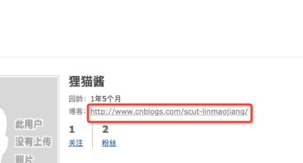
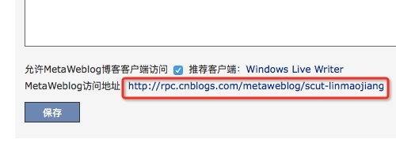

# 使用mweb 来写博客
> 一直在想如果可以一个按键就能发布博客到各个博客网站，那该有多完美的事。

1. 发布到csdn 上
网站地址：http://blog.csdn.net/[用户名]
API地址：http://write.blog.csdn.NET/xmlrpc/index

2. 发布到oschina 上
网站地址：http://my.oschina.net/u/[用户名]/blog
API地址:http://my.oschina.net/action/xmlrpc

3. 发布到cnblog
网站地址：[个人信息]->

API地址：点击[设置],页面的最底部可以看到一个超链接地址:

